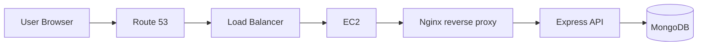

# Model Homes of the Golden Gate International Exposition, 1939-40

> This documentation is for the **Node.js backend** of [ggiemh.com](https://ggiemh.com).

## About

### Description

`ggiemh.com` is a content-driven website that documents the rediscovered "model homes" built around the San Francisco Bay Area for the Model Home project of the Golden Gate International Exposition, a World's Fair held on Treasure Island in 1939-40. This application is a REST API handling requests for data about the homes. The application emphasizes solid architecture, reliability testing, security, and automated cloud deployment. 

### Tech Stack

- Language: TypeScript
- Framework: Express.js
- Database: MongoDB
- Lint &amp; Format: Biome w/Husky pre-commit
- Testing: Vitest
- Logging: Winston
- Deploy: Docker, AWS

## Endpoints

| **Method**  | **Endpoint** | **Description** | **Access** |
| ------------- | ------------- | ------------- | ------------- |
| GET  | `/` | Health check route sends code `200` | Public |
| GET  | `/homes` | Sends a list of all homes | Public |
| GET  |`/homes/:id` | Sends a single home, or error code `400` if `id` is invalid | Public |

## Security

- **CORS**: restricts resource sharing to `ggiemh.com` and local development origins.
- **NGINX**: an NGINX server is configured as a reverse proxy, intercepting and filtering client requests before sending them to the API.

Planned: 

- Rate limiting: configure with NGINX
- Helmet: adds security headers to HTTP responses to help prevent a variety of attacks.

## Deployment

### CI/CD

Continuous integration is managed via a GitHub Actions deployment workflow. New and updated pull requests trigger the `test` workflow that lints and tests the codebase, ensuring reliability before merging new code into the `main` branch.

The `deploy` workflow runs when code is merged into the codebase and performs several jobs:

1. Builds and pushes a new Docker image to Docker Hub.
2. Uploads Docker Compose and NGINX build artifacts to an AWS S3 bucket
3. Pulls build artifacts from the S3 bucket to an AWS EC2 instance
4. Pulls, builds, and runs updated NGINX and application images using Docker Compose.

### Cloud deployment

The backend application is deployed using several AWS cloud services, including:

- Route 53: Configure and manage the application's domain, subdomains, and DNS records.
- AWS Certificate Manager (ACM): Create and manage the SSL/TLS certificates needed to enable secure HTTPS communication.
- Elastic Compute Cloud (EC2): Provision the computing resources needed to run the application.
- Application Load Balancer (ALB): Provision a load balancer to handle HTTPS termination, redirect HTTP to HTTPS, and route incoming traffic to EC2.

#### Deployment diagram



## Additional Information

### Running the app locally

With the correct environment variables the application can be run locally, without containers or NGINX, on any port.

#### Requirements

- Node.js installed
- MongoDB access
  - User credentials
  - Connection string

#### Environment variables

```txt
PORT=<port number>
FRONTEND_URL=https://ggiemh.com
MONGODB_CLUSTER=<cluster id>
MONGODB_USERNAME=<your-username>
MONGODB_PASSWORD=<your-password>
MONGODB_DB_NAME=<db-name>
```


#### Installation steps

```bash
# Install deps
npm install

# Run app in dev mode
npm run dev

# Lint and fix
npm run lint:fix

# Run tests
npm run test

# Build
npm run build
```

### Links
- [Frontend repository](https://github.com/tdkent/ggiemh-frontend)
- [Visit ggiemh.com](https://ggiemh.com)